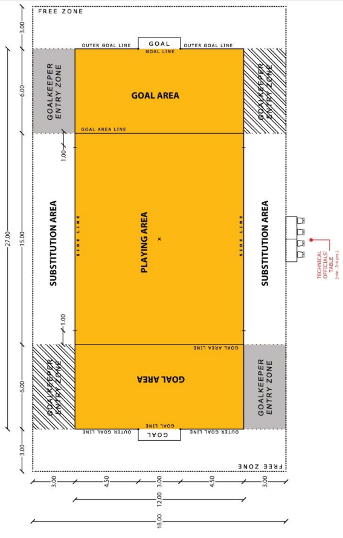
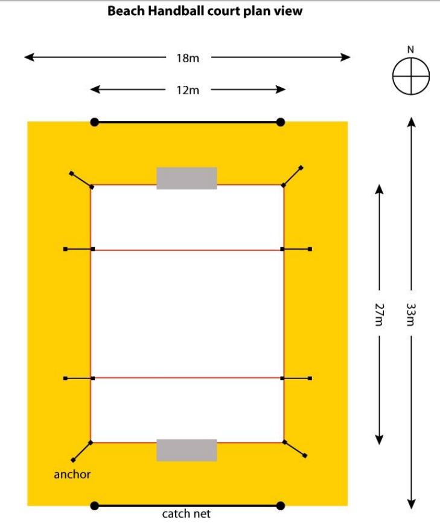
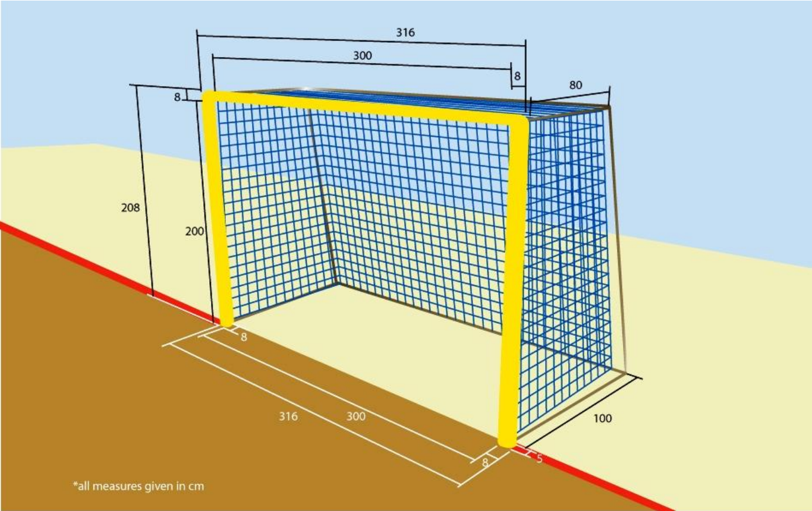

## Playing Court

### 1:1
The playing court (see [diagram 1](#diagram-1)) s a 27 metres long and 12 metres
wide rectangle, consisting of a playing area and two goal areas.
Dimensions of the court are measured from the outer edge of the
boundary lines.

The playing surface must be composed of levelled sand, as flat and
uniform as possible, free of rocks, shells and anything else, which can
represent risks of cuts or injuries to the players.

The sand must be of at least 40 centimetres deep and composed of
fine loosely compacted grains.

The court should run lengthwise north-south.

The characteristics of the playing court must not be altered during the game in such a way that one team gains an advantage.

There should be a safety zone with a width of 3 metres surrounding
the playing court.

The weather must not present any danger of injury to the players.

For competitions played during the night, the lighting on the playing area should be 400 lux (minimum).

### 1:2
The court is marked with lines (see [diagram 1a](#diagram-1a)). These lines belong to the areas of which they are boundaries. The two longer boundary lines are called sidelines. The two shorter boundary lines are called goal lines, although there is no line between the goalposts. The goalarea lines are 6 metres from and parallel to the goal line.

The court is divided into two halves by an imaginary halfway line. The middle of this imaginary line is the exact position for the referee throw.

### 1:3
All lines are between 5 and 8 centimetres wide and are made of solid colour tape contrasting with the sand (blue, yellow or red). The tape must be flexible and hard-wearing but must not harm the players’ and officials’ feet, firmly anchored to the sand at each corner and at the intersection of each goal-area line/sideline with buried dead man anchors.

A bungee cord should be attached to each corner and connected to buried wood or a plastic anchor disk (without sharp edges). The bungee will provide the tension necessary to keep the boundaries in place while giving the flexibility to reduce the chances of injury should a player or official catch their foot under the line. The goals are affixed to the lines with rubber rings attached to the posts. The anchors must not create a danger for the players and officials.

## Goal

### 1:4
* a) A rectangular goal shall be positioned at the middle of each goal
line. It must consist of two upright posts equidistant from each corner
and joined at the top by a horizontal crossbar.

* b) The goal posts shall extend vertically and the height shall be
2 metres from the sand surface to the underside of the crossbar, and
the internal distance between the vertical goal posts shall be
3 metres (see [diagrams 2](#diagram-2)).

* c) The goal posts and horizontal crossbar that form the tubular
aluminium frame shall be of a specified design with an external
diameter of 8 centimetres and shall be painted in a solid colour
contrasting clearly with the sand and with the background (yellow,
blue, or red). The colour of both goals must be the same.

* d) The goal posts and horizontal crossbar shall be completed by a
frame supporting the netting, the deepest point of which shall be
80 centimetres at the top and 1 metre at the bottom.

* e) Each goal must include a net, made of heavy duty nylon (or other
similar synthetic material, knotless, mesh 80 mm x 80 mm or smaller,
thickness 6 mm) attached to the back of the goal posts and crossbar.
This must be fastened in such a way that a ball thrown into the side of
the goal cannot enter the net between the post and the net and be
mistaken for a goal, and that a ball thrown into the goal does not
leave the goal or pass out between the net and the posts of the goal
and be mistaken for a miss, provided as well that is properly
supported and do not interfere with the goalkeeper.
The lower part of the net must be attached to curved tubing or another
suitable means of support in such a way that a ball entering the goal
cannot pass beyond the net. The colour of the net must contrast
against the sand and the background and be the same as the goal. 

* f) For the safety of the players and officials, the bottom of each goal
must be appropriately anchored beneath the sand. The anchors must
not create a danger for the players.

* g) At 3 metres behind each goal area catch (stopping) nets must be
loosely suspended along the entire length of the playing court (12 m x
7 m high). The catch (stopping) nets must adequately reach the sand.

## Table of timekeeper and scorekeeper

### 1:5
The table of the timekeeper and scorekeeper shall have room for 3 to
4 persons and is placed in the middle of a sideline and at least 3
metres outside of it.
The table of the timekeeper and scorekeeper has to be placed in such
a way that the timekeeper/scorekeeper can see the substitution
areas.

## Substitution areas

### 1:6 
The substitution area for the court players is 15 metres long and about
3 metres wide. The substitution areas are situated on each side of the
playing area outside the sidelines. The court players must enter the
court only from this area.

### 1:7
* a) It is allowed to the goalkeeper and the court players to leave the
playing area on the shortest way on the side of their own team’s
substitution area. This practically means that the players can leave
the playing court beyond the whole sideline of the playing area
and the goal areas on the side of their own team’s substitution
area.

* b) The goalkeepers must enter the court over the sideline of their
own team‘s goal area from the side of their own team’s
substitution area (Rules [4:13](#4:13), [5:12](#5:12)).

* c) The substitute goalkeeper is allowed to await his turn to enter the
court by seating (or kneeling) at the sideline part between his team’s goal line and the goal-area line.

#### Diagram 1
The Playing Court

### Diagram 1a
The Playing Court Plan View

### Diagram 2
The Goal

