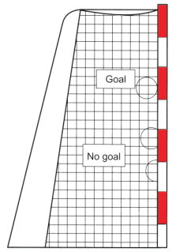

# Scoring and Deciding the Outcome of the Game

## Scoring

### 9:1
A goal is scored when the entire ball has crossed the entire width of
the goal line (see [diagrams 3](#diagram-3)), provided that no violation of the
rules has been committed by the thrower or a teammate before or
during the throw.

A goal shall be allowed, if there is a violation of the rules by a
defender but the ball still goes into the goal.

A goal cannot be awarded, if a referee or the timekeeper has
interrupted the game before the ball has completely crossed the goal line.

A goal shall be awarded to the opponents, if a player plays the ball
into his own goal, except in the situation where a goalkeeper is
executing a goalkeeper throw and the ball does not cross the goalarea line (Rules [12:2](#12:2), 2nd paragraph). An own goal scored by any
player is awarded with one point.

***Comment:***

A goal shall be awarded, if the ball is prevented from going into the goal by
someone or something not participating in the game (spectators, etc.), and
the referees are convinced that the ball would otherwise have entered the
goal.

### 9:2
Creative or spectacular goals are awarded with two points (see
[Clarification No.1](#1.-awarding-of-points)).

### 9:3
A goal scored by a 6-metre throw is awarded with two points.

### 9:4 
After a goal is scored, the game is restarted with a goalkeeper throw
from the goal area (Rule [12:1](#12:1)).

### 9:5 
A goal that has been awarded can no longer be disallowed, once the
referee has allowed the goal and the goalkeeper throw has been
taken.

The referees must make clear (without a goalkeeper throw) that they
have allowed a goal, if the signal for the end of a period sounds
immediately after a goal is scored and before a goalkeeper throw can
be taken.

## Scoring by the goalkeeper

### 9:6 
Two points are awarded when a goal is scored by the goalkeeper.

## Deciding the outcome of the game

### 9:7 
If the score is even at the end of a period, the “Golden Goal” method
is used, i.e. the winner is the team that scores the first goal (Rule [2:6](#2:6)).

### 9:8 
If both teams have won a period, a “Shoot-out” is used.
Five players who are eligible to play take throws alternating with the
opposing team. If a goalkeeper is one of the throwers, he counts as a
court player when he takes his throw (Rule [4:8](#4:8) Comment).

The winner is the team that has scored more points after five throws.
If the outcome has not been decided after the first round, the “Shootout” is continued. For this purpose the ends shall be changed first
(without changing the substitution area - see Comment). Again five
players who are eligible to play take throws alternatively with the
opposing team. Now the other team goes first.

In this round and any subsequent round the match is decided as soon
as one team takes the lead once there has been an equal number of
attempts by each team.

***Comment:***
**Deciding the outcome of the game by using the “Shoot-out”:**

In the “Shoot-out” the referees use a coin toss in order to determine the
choice of ends and which team starts (see [Clarification No. 2](#2.-special-circumstances)).

If a team has won the coin toss and decides to start the “Shoot-out”, then
the opponents have the right to choose ends. Alternatively, if the team that
wins the coin toss prefers to choose ends, then the opponents have the
right to start the “Shoot-out”.

Both goalkeepers start off standing on the goal line at least with one foot.
The court player must stand in the playing area with one foot on the right or
left point where the goal-area line and the sideline cross. When the referee
blows the whistle he plays the ball back to his goalkeeper on the goal line.
During the pass the ball is not allowed to touch the sand. Once the ball has
left the player’s hand both goalkeepers may move forward. The goalkeeper
with the ball must remain in his goal area.

Within 3 seconds he must either take a shot at the opposing goal or pass
the ball to his teammate, who is running towards the opponent’s goal. Also
during this pass, the ball is not allowed to touch the sand.

The player must catch the ball and try to score a goal, without any rule
violation.

If the attacking goalkeeper or the court player commits a rule violation, the
attack is over.

If the defending goalkeeper leaves his goal area, then he is allowed to go
back into his goal area at any time.

If the number of players drops below 5 in one round, the team in question
will have correspondingly fewer throwing opportunities, because no player
is allowed to throw a second time.

### 9:9 
If the defending goalkeeper saves a goal in the “Shoot-out” by
violating a rule, a 6-metre throw has to be awarded (see [Clarification No. 9](#9.-shoot-out-and-fast-break)).

***Comment:***
Every player who is eligible to play is allowed to execute this 6-metre throw.

### 9:10 
During the “Shoot-out”, all the court players involved must remain in
their substitution area. Players who have taken their throw go back to
their substitution area.

### Diagram 3
Scoring

