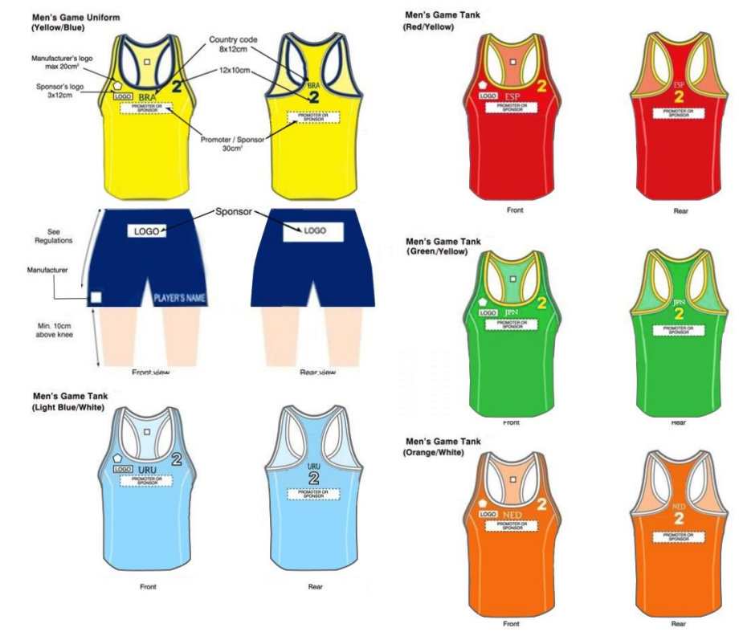
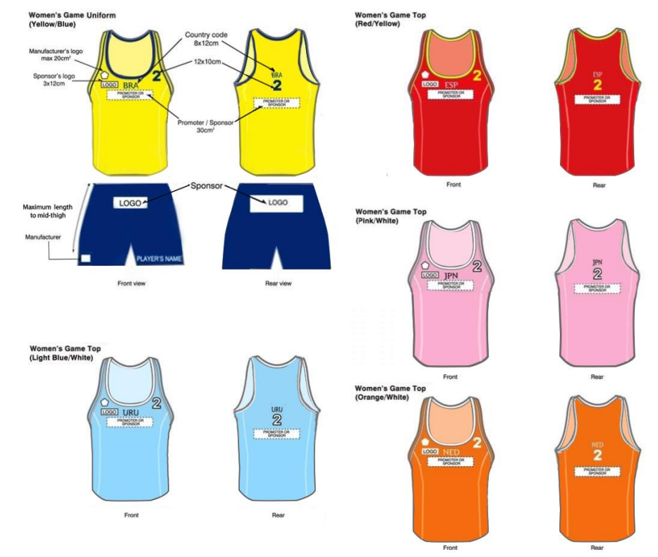

# Athlete Uniform Regulations

Athletes’ uniforms and accessories contribute to helping athletes increase
their performance as well as remain coherent with the sportive and
attractive image of the sport.

This part of the rules provides all the details concerning uniform and
accessory specifications with regards to colour, style, quantity, fabric and
brandings, which all teams and organizers are expected to utilize.

The Competition Management (CM) must check each participating team’s
athletic uniforms during the Technical Meeting (TM) and during the event.
All men’s and women’s athletic uniforms must correspond to the standards
indicated hereunder. According to the Olympic Charter, religious, political
and racial messages are strictly forbidden on athletic uniforms.

### Men’s tank top / Women’s top style
The style of the tank tops / tops must be in accordance with the graphs
shown. The men’s tank tops must be sleeveless and close fitting, and
respect the space for the required brandings. The women’s tops (a midriff
design) must be close fitting as well, with deep cutaway armholes on the
back, always respecting the space for the required brandings. T-shirts that
are worn under the team’s official tank top are not allowed.

#### Color
Tank tops / tops will be of bright and light colours (i.e. red, blue, yellow,
green, orange and white) in the attempt to reflect the colours usually
used and worn on the beach.

#### Brandings
- Promoter’s / sponsor logos:

   The promoter’s/sponsor logos can be printed on the front and back
of the men’s tank tops and on the front and back of the women’s
tops.
- Manufacturer’s logo:

   The manufacturer’s logo is printed on the front of the tank tops / tops
and must not exceed 20 cm2.

#### Athlete’s number
The athlete’s number (of approx. 12x10 centimetres for the men’s tank
tops and 8x6 centimetres for the women’s tops) must be placed on the
front and back of the men’s tank tops and the women’s tops. This
information must be printed in a contrasting colour to that of the tank
top / top (i.e. light on a dark tank top/top, dark on a light tank top / top).

### Men’s shorts / Women’s bikini bottoms style
Team members must wear identical shorts/bikini bottoms. Male athletes
must wear shorts as per the enclosed graph. The players’ shorts, if not too
baggy, can be longer but **must remain 10 centimetres above the
kneecap**. Female athletes must wear bikini bottoms that are in accordance
with the enclosed graph, with a close fit and cut on an upward angle toward
the top of the leg. The side width must be **of a maximum of 10
centimetres**.

Teams are authorized to have sponsor logos (including manufacturer) on
their shorts/bottoms (or one-piece bathing suits), located in any position and
of any size.

There is no limitation in the number of the sponsors to be displayed on the
shorts/briefs. Athletes are required to print their name and nickname on
their shorts/bottoms.

The respective team officials must submit their own team’s uniforms (tank
tops / tops, shorts/bottoms or one-piece bathing suits) for approval during
the pre-competition TM.

T-shirts that are worn under the team’s official tank top are not allowed.

Furthermore, any thermo-trousers must be in the same colour of the
respective part of the uniform.

### Cold temperature
During severe weather conditions, players will be allowed to use
uniforms composed of tight shirt, long tight pants (down to the ankle
and not to the knees). These must be consistent in style and colour
following the same marketing rules as for the players’ shorts and briefs,
regardless of size and position. The CM will be ultimately responsible
to allow players to wear such a special uniform whenever will be
required, after having consulted with the official medical staff.

The cold weather uniform shall be composed of a tight shirt with long
or short sleeve and/or long tight pants. This uniform must be tight to
the body and consistent in style, length and colour for all athletes within
the same team.

For the cold weather tank tops / tops, sponsor logos are allowed on the
cold weather gear for both men and women. For cold weather pants,
sponsor logos are allowed both for men (wearing their shorts on top)
and women (not wearing their briefs on top), according to the general
ruling, as stated above.

### Men's Uniform

### Women's Uniform

