# Hand Signals

## Guidelines

1. If 1 or 2 points are credited when a goal is scored (Rules [9](#9), [14:4](#14:4), [Clarification No. 1](#1.-awarding-of-points)), then the court referee must indicate this by displaying 1 or 2 fingers. When 2 points are awarded, the goal referee
does a full vertical arm swing additionally.
2. Hand Signal [12](#12---suspension): The referee indicates the rule violation and points
to the offending player.
A bent arm, grabbed at the wrist by the other arm, indicates a
suspension.
3. The referee uses a red card to indicate an “immediate”
disqualification.
4. Disqualifications must be clearly confirmed by a red card being held
in the air by the scorekeeper.
5. When a free throw or throw-in is called, the referees must show
immediately the direction for the throw that is to follow (Hand Signal
[7](#7---throw-in-–-direction) or [9](#9---free-throw-–-direction)).

   Thereafter, as applicable, the appropriate obligatory Hand Signal(s)
should be given to indicate any personal punishment (Hand Signals
[12](#12---suspension)-[13](#13---disqualification)).
 
   If it seems that it would also be useful to explain the reason for a free
throw or 6-metre throw decision, then the applicable one of Hand
Signals [1-6](#1---advantage) could be given for the sake of information.
6. Hand Signals [11](#11.1---gaining-1-point), [14](#14---time-out) and [15](#15---permission-for-two-persons-(who-are-entitled-to-participate)-to-enter-the-court-during-time-out) are mandatory in those situations where
they apply.
7. Hand Signals [8](#8---goalkeeper-throw), [10](#10---keep-the-distance-of-1-meter) and [16](#16---forewarning-signal-for-passive-play) are used as deemed necessary by the
referees.

**List of the hand signals:**

1. [Advantage](#1---advantage)
2. [Double dribble](#2---double-dribble)
3. [Travelling or holding the ball more than three seconds](#3---travelling-or-holding-the-ball-more-than-three-seconds)
4. [Restraining, holding or pushing](#4---restraining,-holding-or-pushing)
5. [Hitting](#5---hitting)
6. [Offensive foul](#6---offensive-foul)
7. [Throw-in – direction](#7---throw-in-–-direction)
8. [Goalkeeper throw](#8---goalkeeper-throw)
9. [Free throw – direction](#9---free-throw-–-direction)
10. [Keep the distance of 1 meter](#10---keep-the-distance-of-1-meter)
11. [Gaining Points](#11.1---gaining-1-point)
    1. [Gaining 1 point](#11.1---gaining-1-point)
    2. [Gaining 2 points](#11.2---gaining-2-points)
12. [Suspension](#12---suspension)
13. [Disqualification](#13---disqualification)
14. [Time-out](#14---time-out)
15. [Permission for two persons (who are entitled to participate)
    to enter the court during time-out](#15---permission-for-two-persons-(who-are-entitled-to-participate)-to-enter-the-court-during-time-out)
16. [Forewarning signal for passive play](#16---forewarning-signal-for-passive-play)

## 1 - Advantage

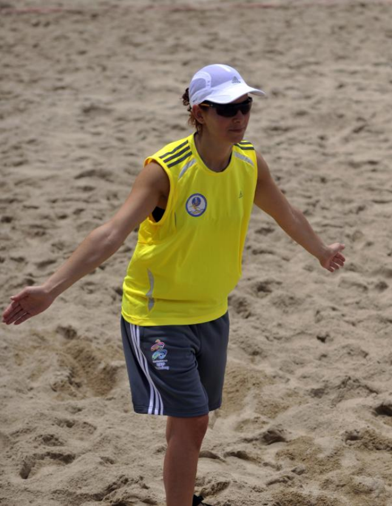

## 2 - Double dribble

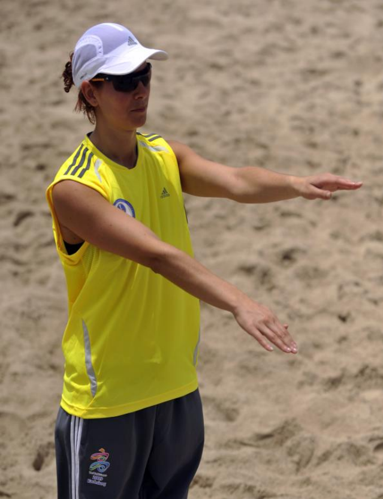

## 3 - Travelling or holding the ball more than three seconds

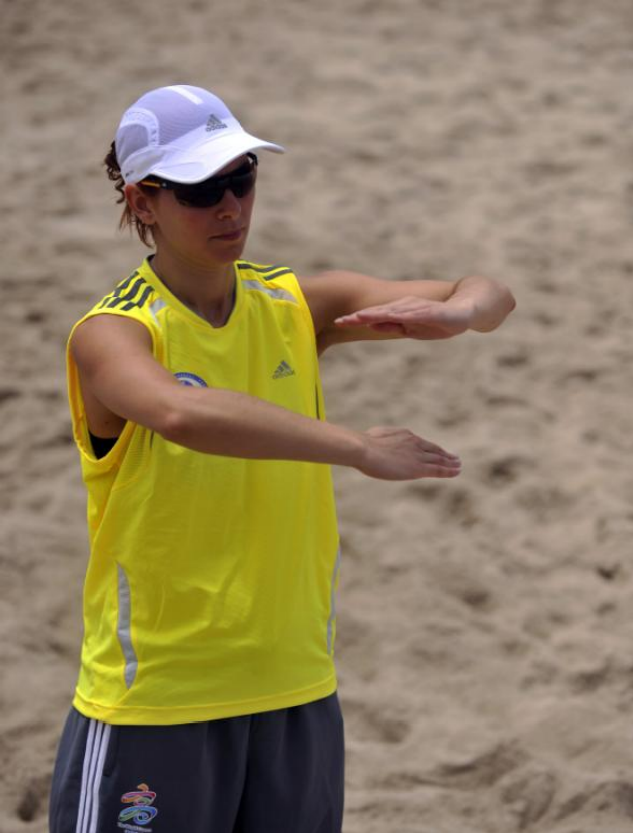

## 4 - Restraining, holding or pushing

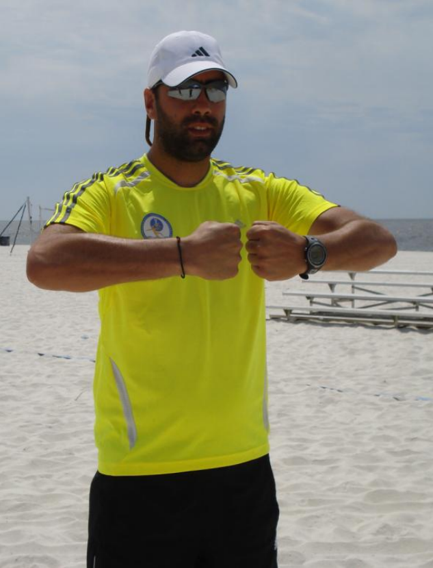

## 5 - Hitting

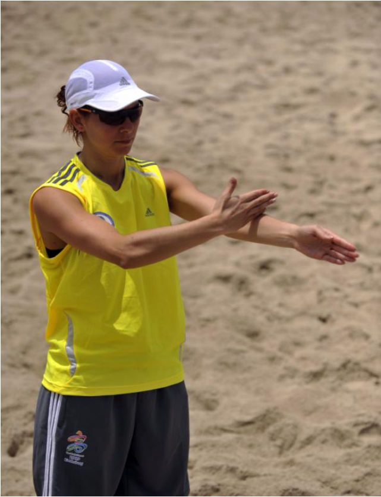

## 6 - Offensive foul

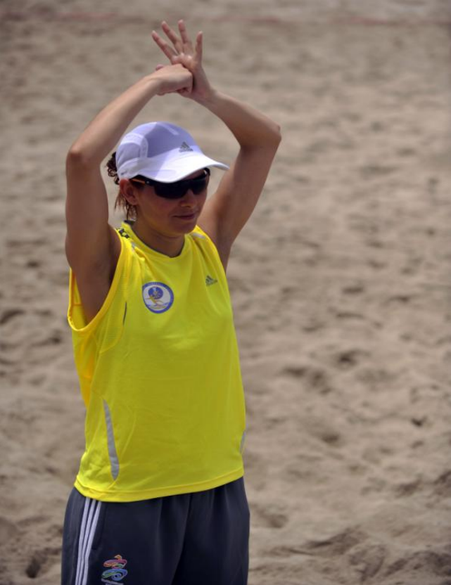

## 7 - Throw-in – direction

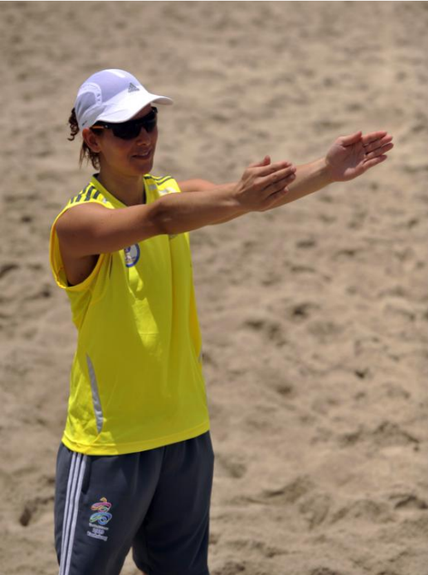

## 8 - Goalkeeper throw

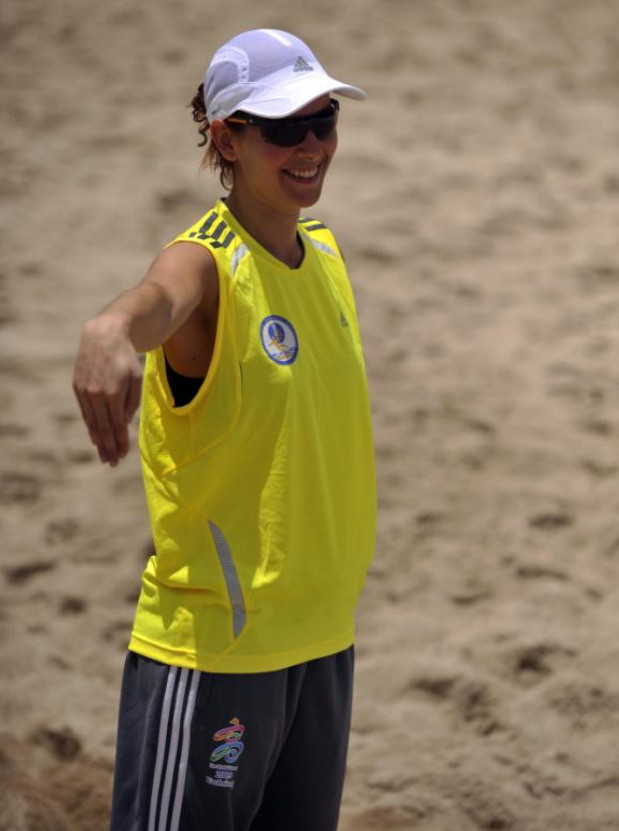

## 9 - Free throw – direction

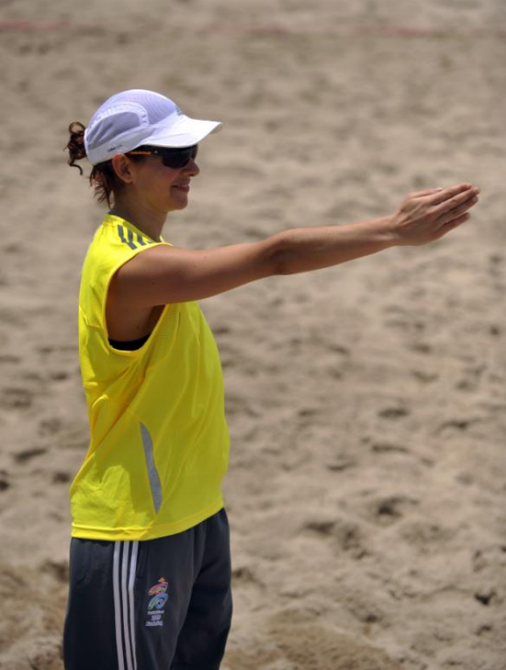

## 10 - Keep the distance of 1 meter

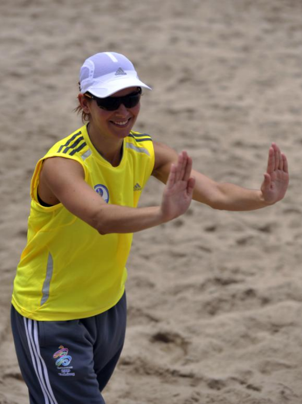

## 11.1 - Gaining 1 Point

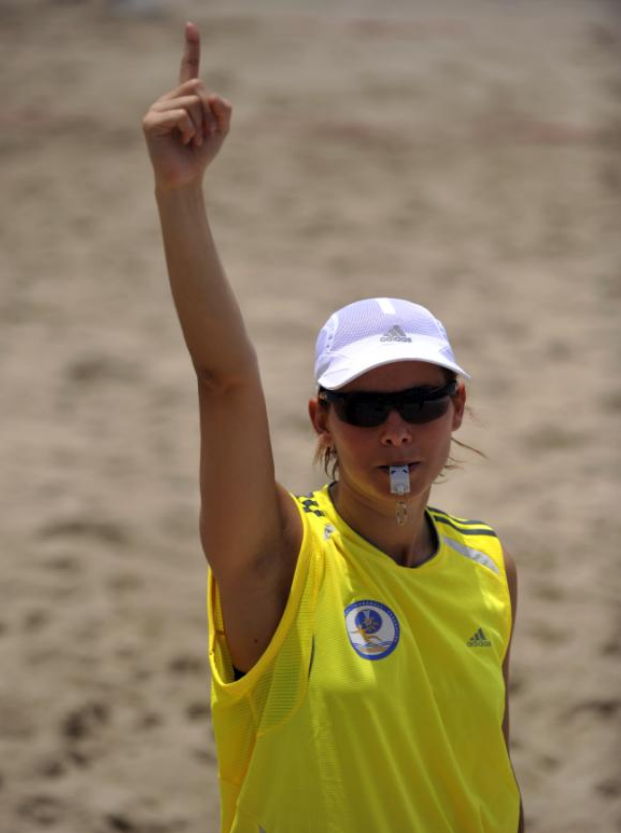

## 11.2 - Gaining 2 Points

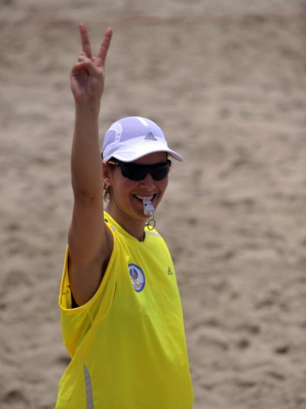

## 12 - Suspension

## 13 - Disqualification

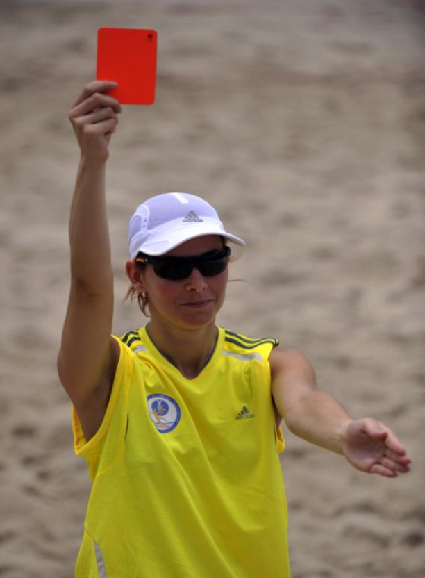

## 14 - Time-out

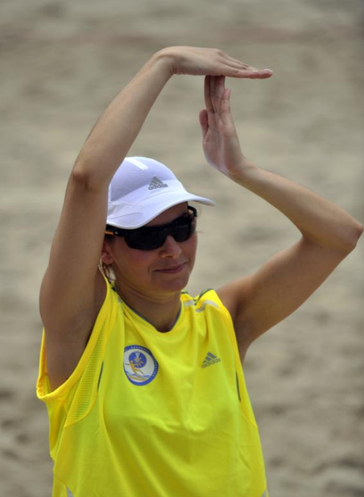

## 15 - Permission for two persons (who are entitled to participate) to enter the court during time-out

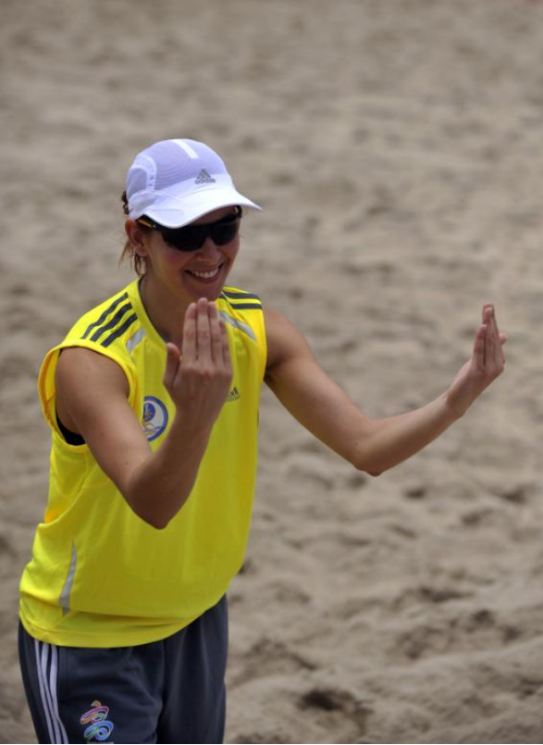

## 16 - Forewarning signal for passive play

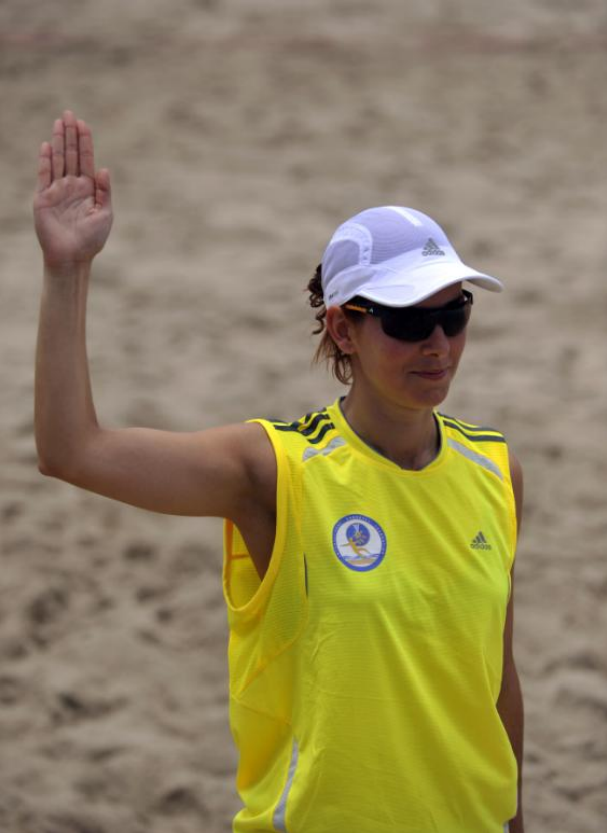
