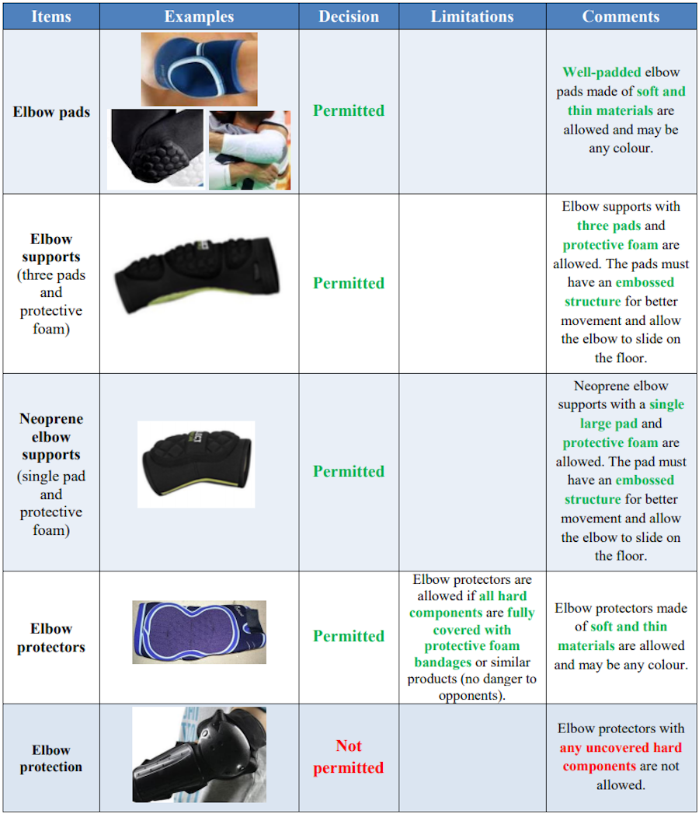
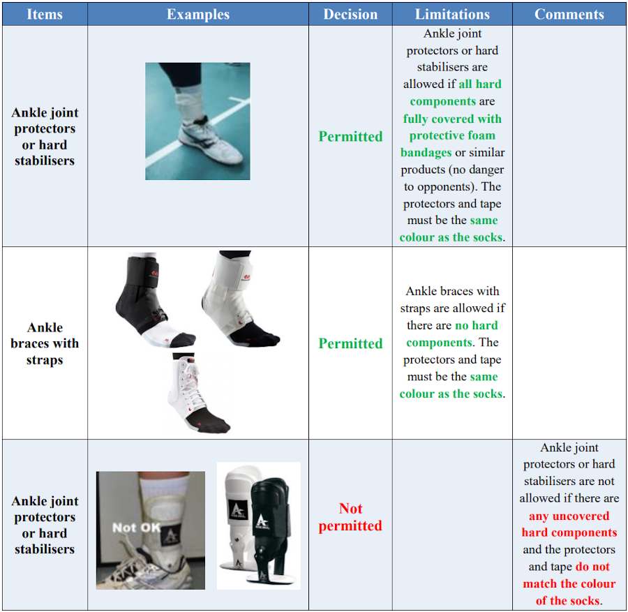
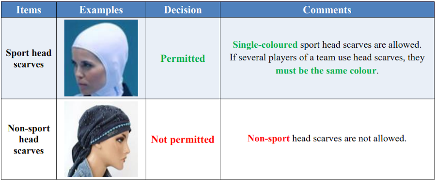
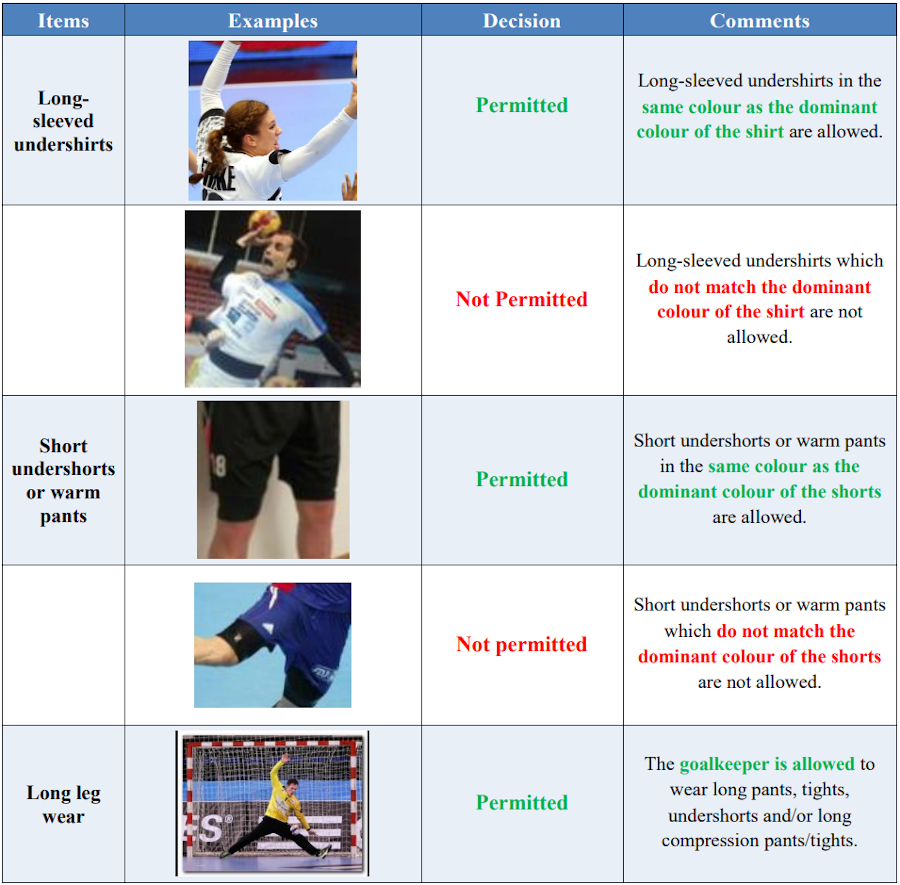

# Regulations on Protective Equipment and Accessories

Edition: July 2017

*Source: https://www.ihf.info/sites/default/files/2019-07/0_Regulations%20on%20Protective%20Equipment%20and%20Accessories_GB.pdf*

## 1. Head/face protection

|Items          |Examples                                                   |Decision     |Limitations  |Comments                 |
|---------------|-----------------------------------------------------------|-------------|-------------|-------------------------|
|Masks          |          |Not permitted|             |Masks are not allowed.   |
|Helmets        |      |Not permitted|             |Helmets are not allowed. |
|Nose protection||Permitted    |Only soft, single-coloured materials and tapes are allowed.||

## 2. Headbands

|Examples                                                                                                               |Decision     |Limitations  |Comments                 |
|-----------------------------------------------------------------------------------------------------------------------|-------------|-------------|-------------------------|
| |Permitted    |Only headbands which are elastic, thin and narrow are allowed.||
| |Not permitted|             |Headbands which are not elastic, not thin enough and/or too wide are not allowed.|

## 3. Glasses and goggles

|Examples                                                                                                                                                                                                      |Decision     |Comments                 |
|--------------------------------------------------------------------------------------------------------------------------------------------------------------------------------------------------------------|-------------|-------------------------|
|  |Permitted    |Sport glasses and goggles with special sports headbands, solid plastic lenses, and temples made of silicon or other elastic materials are allowed.|
|                                                                                                                                          |Not permitted|Sport glasses and goggles with rigid temples are not allowed.|

## 4. Tooth protection

|Examples                                                                                                                       |Decision     |Comments                 |
|-------------------------------------------------------------------------------------------------------------------------------|-------------|-------------------------|
|                                                                |Permitted    |Transparent and single-coloured mouth guards are allowed.|
| |Not permitted|Non-transparent and multi-coloured mouth guards are not allowed.|

## 5. Shoulder protection and compression sleeves

## 6. Elbow protection

## 7. Knee protection

## 8. Compression calf supports

## 9. Ankle joint protection

## 10. Clothes

***Summary:***

- Long leg wear is not allowed (with the exception of the goalkeeper).

- Four pieces (undershorts + knee protector + compression calf supports + socks) are allowed. These must be four separate pieces.

- Compression and long sleeves must match the dominant colour of the shirt.

- Undershorts must match the dominant colour of the shorts.

- Compression calf supports must match the colour of the socks.

- Ankle protectors must match the colour of the socks.

- Elbow and knee protectors may be of any colour(s).

## 11. Accessories

