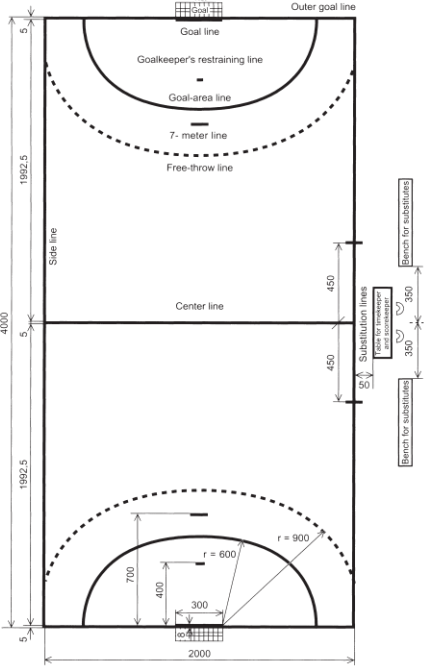
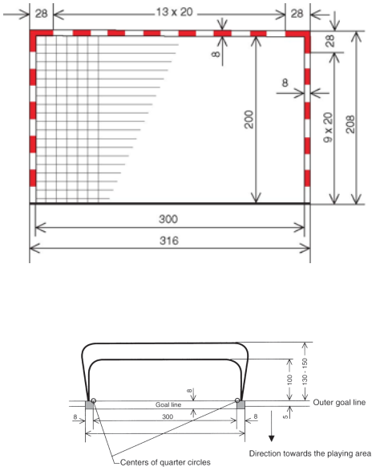
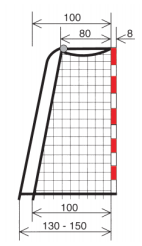
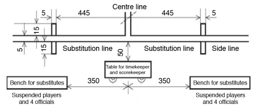

## El terreno de juego

#### 1:1
El terreno de juego (ver [Fig.1](#gráfico-1)) es un rectángulo de 40 metros de largo y 
20 metros de ancho, que consta de dos áreasde portería (ver regla [1:4](#1:4) y 
regla [6](#6:1)) y un área de juego. Las líneas más largas se llaman líneas de banda y 
las más cortas líneas de gol (entre los postes de la portería) o línea exterior de portería
(a ambos lados de la portería).

Debería haber un pasillo de seguridad alrededor del terreno de juego, con un ancho mínimo 
de 1 metro por el exterior de las líneas de banda y de 2 metros tras la línea de gol y 
línea exterior de la portería.

Las características del terreno de juego no deben ser modificadas durante el partido de
tal forma que un equipo gane alguna ventaja.

#### 1:2
La portería (ver [Fig. 2a](#gráfico-2a) y [2b](#gráfico-2b)) está situada en el centro 
decada línea exterior de portería. Las porterías deben estar firmemente fijadas al suelo o 
a las paredes que están detrás de ellas. Sus medidas interiores serán de 2 metros de alto
y 3 metros de ancho.

Los postes de la portería están unidos con el larguero, y sus aristas posteriores estarán 
alineadas con el lado posterior de la línea de gol. Los postes y el larguero tienen que 
tener una sección cuadrada de 8 centímetros y pintadas las tres caras visibles del lado del 
terreno de juego con dos colores que contrasten claramente con el fondo del campo.

Las porterías tendrán una red que debería estar sujeta de tal forma que un balón lanzado 
dentro de la portería normalmente se quede dentro de ella.

#### 1:3
Todas las líneas del terreno forman parte de la superficie que encierran. Las líneas de gol 
medirán 8 centímetros de ancho entre los postes de la portería (ver [Fig. 2a](#gráfico-2a)) 
mientras que  las otras líneas serán de 5 centímetros de ancho.

Se pueden eliminar las líneas entre dos áreas adyacentes del suelo, pintando dichas áreas 
de colores diferentes.

#### 1:4
Delante de cada portería está el área de portería (ver regla 6). El área de portería está 
definida por la línea del área de portería (línea de 6 metros), que se marca como sigue:

* a) una línea de 3 metros de largo directamente delante de la portería; esta línea es 
paralela a la línea de gol y se situará a una distancia de 6 metros de ésta (medidos
desde el lado exterior de la línea de gol hasta la parte delantera de la línea de área de 
portería);

* b) dos cuartos de círculo, cada uno con un radio de 6 metros (medido desde la esquina 
interior de los postes de la portería), conectando la línea de 3 metros de largo con la 
línea exterior de portería (ver [Fig. 1](#gráfico-1) y [2a](#gráfico-2a)).

#### 1:5
La línea de golpe franco (línea de 9 metros) es una línea discontinua; se marca a 3 metros
por fuera de la línea del área de portería. Tanto los segmentos de la línea como los
espacios entre ellos medirán 15 centímetros. (ver [Fig. 1](#gráfico-1)).

#### 1:6
La línea de 7 metros será de 1 metro de largo y estará pintada directamente frente a la 
portería. Será paralela a la línea de gol y se situará una distancia de 7 metros de ella 
(medida desde la parte posterior de dicha línea hasta el exterior de la línea de 7 metros)
(ver [Fig. 1](#gra-1)).

#### 1:7
La línea de restricción del portero (la línea de 4 metros) será de 15 centímetros de 
longitud y se traza directamente delante de la portería. Es paralela a la línea de gol y 
se sitúa a una distancia de 4 metros de ella (medida desde la parte posterior de dicha 
línea hasta el exterior de la línea de 4 metros); (ver [Fig. 1](#gráfico-1)).

#### 1:8
La línea central conecta los puntos medios de las dos líneas de banda (ver 
[Fig.1](#gráfico-1) y [3](#gráfico-3)).

#### 1:9
La línea de cambios (un segmento de la línea de banda) para cada equipo se extiende desde 
la línea central a un punto situado a una distancia de 4’5 metros de ella. Este punto final 
de la línea de cambio está delimitado por una línea que es paralela a la línea central, 
extendiéndose 15 centímetros hacia dentro de la línea de banda y 15 centímetros hacia fuera 
de ella (ver [Fig.1](#gráfico-1) y [3](#gráfico-3)).

***Nota:***

*Pueden encontrarse requisitos técnicos más detallados para el terreno de juego y las 
porterías en las [Directrices para el terreno de juego y las porterías](#directrices-para-el-terreno-de-juego-y-las-porterías).***

#### Gráfico 1
El terreno de juego

Las dimensiones se indican en centímetros

Terreno de juego: ver también [gráfico 5](#gráfico-5)

#### Gráfico 2a
La portería

#### Gráfico 2b
La portería – vista lateral

#### Gráfico 3
Líneas y zonas de cambios

La mesa para el anotador y el cronometrador y los bancos de reservas deben estar situados 
de tal manera que las líneas de cambios puedan ser visibles para el anotador y cronometrador. 
La mesa debería estar colocada más cerca de la línea de banda que los bancos de reservas,
pero separada de ésta como mínimo 50 centímetros.
