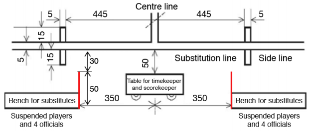

# Directrices e interpretaciones

## Sustitución de jugadores y oficiales (4:1-4:2)
Si un equipo no ha completado el total de jugadores (regla 4:1)
o de oficiales (regla 4:2), autorizados a participar, está autorizado a:

- Habilitar a un jugador registrado como tal para que pueda
  actuar como oficial
- Habilitar a un oficial registrado como tal para que pueda
  actuar como jugador hasta el final del partido (incluidas las
  prórrogas).

El número máximo de jugadores y/u oficiales registrados no puede
ser sobrepasado.

La función original del jugador o del oficial debe ser eliminada del
acta No se permite volver a reemplazar a un jugador o un oficial a
su función original cuando haya sido cambiado previamente. Esta
igualmente prohibido borrar a un participante de cierta función con
el fin de efectuar una sustitución cumpliendo con el número máximo
autorizado. Está prohibido inscribir una persona a la vez como
jugador y oficial.

La IHF, las Federaciones Continentales y las Federaciones
Nacionales tienen, en el ámbito de sus competencias, la posibilidad
de aplicar normativas más restrictivas.
Las sanciones personales recibidas antes del cambio de función
(amonestaciones, exclusiones), serán tenidas en cuenta tanto a
nivel personal, como en las respectivas cuotas como “jugador” y
como “oficial”.

## Líneas del terreno de juego (Reglamento relativo a la zona de cambios regla 1, apartado 1)

La línea de restricción del “área de entrenadores” se proporciona
con fines informativos. Está línea tendrá 50 centimetros de largo y
se pintará a una distancia de 350 centimetros (fuera de la terreno de
juego, paralela a la línea central). Comienza a una distancia de 30
centimetros fuera de la línea de banda (dimensiones recomendadas).

## Tiempo muerto de equipo (2:10, aclaración Núm. 3)
El comienzo de los últimos 5 minutos de juego comienza cuando el
cronómetro indica 55:00 o 05:00.

## Sustitución de jugadores (4:4)
Los jugadores deben entrar y abandonar el terreno de juego por la
propia zona de cambios. Constituye una excepción los jugadores
lesionados que abandonen el terreno de juego con el tiempo de
juego interrumpido.

Esos jugadores no deben ser forzados a abandonar el terreno de
juego por la zona de cambios cuando sea evidente que necesitan
asistencia médica en la zona de cambios o en los vestuarios.
Además, los árbitros deben autorizar al reemplazante a entrar en el
terreno de juego antes que el jugador lesionado lo haya abandonado,
con el fin de reducir al máximo la interrupción del encuentro.

## Jugadores adicionales (4:6, párrafo 1)

Si un jugador adicional entra en el terreno de juego sin sustitución,
se sancionará al jugador adicional con una exclusión de 2 minutos.
Si no es posible identificar al jugador culpable, se adoptarán las
medidas siguientes:
- El delegado o los árbitros respectivamente solicitarán
  al “oficial responsable de equipo” que señale al jugador
  culpable.
- El citado jugador recibirá una exclusión de 2 minutos como
  sanción personal.
- En caso de que el “oficial responsable de equipo” se niegue
  a señalar al jugador culpable, el delegado o los árbitros
  respectivamente, señalarán a uno de los jugadores que se
  encontrara en el terreno de juego en aquel momento. El
  citado jugador recibirá una exclusión de 2 minutos como
  sanción personal.

***Nota:***

*Solo podrá ser considerado jugador culpable, alguno de los jugadores
de campo que se encontrara en el terreno de juego en el momento
de la interrupción. Un jugador que esté actuando temporalmente
como portero no puede ser designado culpable.*

*En caso de que el “jugador culpable” reciba la tercera exclusión,
deberá ser descalificado de acuerdo con la regla 16:6d.*

## Objetos prohibidos, cascos, protección facial y de las rodillas (4:9)
Se prohíben las máscaras faciales y cascos de todo tipo y tamaño.
No sólo se prohíben las máscaras completas, sino también las que
cubren parte de la cara.

Respecto a rodilleras, no se permiten las que contengan partes
metálicas. Los objetos de plástico deberán cubrirse por completo.

En relación con las tobilleras, deberán cubrirse todas las partes
sólidas de metal o plástico.

Se permiten coderas únicamente si son de material suave/blando.

Ni las Federaciones ni los árbitros están autorizados a hacer ninguna
excepción. Sin embargo, en caso de que un oficial responsable de
un equipo se dirija a un delegado o a un árbitro en caso de duda,
tomarán una decisión basándose en las regulaciones de la regla 4:9
así como en las “Directrices”. En este contexto, los principios más
importantes son “no representar un peligro” y no otorgar “una ventaja
injusta”.

Esta regla ha sido incluida por recomendación de la Comisión
Médica de la IHF.

Ver anexos 1 y 2 para consejos adicionales (acciones recomendadas
para árbitros y delegados)

## Sustancias adhesivas (resina) (4:9)
Está permitido el uso de sustancias adhesivas (resina). Está
permitido su uso en las zapatillas. Esto no representa un riesgo para
la integridad física del adversario.

Sin embargo, no está permitido depositar sustancias adhesivas
(resina) en las manos o en la muñeca. Esto pone en peligro la salud
de los oponentes, ya que podría introducirse en sus ojos o en su
cara. De acuerdo a la regla 4:9 esta práctica no está permitida.

Las Federaciones Nacionales tienen el derecho de aplicar en sus
propios ámbitos restricciones complementarias.

## Asistencia a jugadores lesionados (4:11)

Si varios jugadores de un mismo equipo han resultado lesionados,
por ejemplo después de un choque, los árbitros o el delegado
pueden autorizar a personas suplementarias a entrar al terreno de
juego con el fin de asistir a los jugadores lesionados. Además, los
árbitros y los delegados controlan al personal médico que pudiera
entrar en el terreno de juego.

## Portero lesionado (6:8)
El portero recibe un balonazo y queda imposibilitado para jugar. De
forma general, la protección del portero ha de ser una prioridad. Para
la reanudación del partido, se pueden dar las siguientes situaciones:
- a) El balón sobrepasa la línea de banda o la línea exterior de
  portería, o se queda o rueda sobre el área de portería.

  Aplicación correcta de las reglas de juego: interrupción
  inmediata del juego, y posterior reanudación con el saque de
  banda o saque de portería de acuerdo con cada situación.
- b) Los árbitros interrumpen el encuentro antes de que el balón
  haya sobrepasado la línea de banda o la línea exterior de
  portería o antes de que el balón se quede o ruede sobre el
  área de portería.

  Aplicación correcta de las reglas de juego: reanudación con
  el saque correspondiente a cada situación.
- c) El balón está en el aire por encima del área de portería.

  Aplicación correcta de las reglas de juego: esperar uno o dos
  segundos a que uno de los equipos entre en posesión del balón
  para interrumpir el juego. Reanudación del encuentro con saque
  de golpe franco favorable al equipo en posesión del balón.
- d) El árbitro hace sonar el silbato cuando el balón está todavía
  en el aire.

  Aplicación correcta de las reglas de juego: reanudación del
  encuentro con saque de golpe franco favorable al equipo
  que tuvo posesión del balón en último lugar.
- e) El portero queda imposibilitado por el golpe del balón que
  rebota hacia un atacante.

  Aplicación correcta de las reglas de juego: interrupción
  inmediata del juego, reanudándose con golpe franco
  favorable al equipo en posesión del balón.

***Nota:***

*En ningún caso es posible decidir lanzamiento de 7 metros. Los
árbitros interrumpen deliberadamente el juego para la protección al
portero, por lo tanto ésta no se considerará como una “interrupción
injustificada” de acuerdo con lo indicado en la regla 14:1b.*

## Pasos, comenzar a botar (7:3)
De acuerdo con la regla 7:3c, d, el primer contacto en el suelo con
un pie o los dos pies al mismo tiempo tras recepcionar el balón en
suspensión, no se considera paso (punto cero). No obstante, el
concepto “recepcionar el balón” solo se aplica al recibir el balón de
un compañero, de un contrario o rebotado de la portería.

Ir botando y recoger el balón estando en suspensión no se considera
“recepción del balón” bajo los términos de esta regla. Cualquier
contacto del pie con el suelo después de haber botado el balón se
considera paso sin excepción alguna.

## Cómputo del número de pases tras señalizar la advertencia (7:11)
Ver soporte de entrenamiento en el anexo 3.

## Intervención de jugadores u oficiales adicionales (8:5, 8:6, 8:9, 8:10b)
En caso de entrada en el terreno de juego de oficiales o jugadores
adicionales, se sancionará de acuerdo con los siguientes criterios:
- si es un jugador o un oficial
- si se destruye una clara ocasión de gol

Las siguientes situaciones podrían producirse:

- a) Durante una clara ocasión de gol, un jugador adicional
  penetra en el terreno de juego sin estar efectuando un
  cambio.

  Aplicación correcta de las reglas de juego: lanzamiento de 7
  metros, descalificación con informe escrito

- b) Cambio antirreglamentario. El cronometrador y/o delegado
  hacen sonar la bocina durante una clara ocasión de gol.

  Aplicación correcta de las reglas de juego: lanzamiento de 7
  metros y exclusión.
- c) Durante una clara ocasión de gol, un oficial de equipo entra
  en el terreno de juego.

  Aplicación correcta de las reglas de juego: lanzamiento de 7
  metros, descalificación con informe escrito.
- d) Igual que c), pero sin clara ocasión de gol.

  Aplicación correcta de las reglas de juego: golpe franco,
  sanción progresiva.

## Otras medidas a adoptar trás una descalificación con informe escrito (8:6, 8:10 a, b)
Los criterios para esta nueva sanción máxima quedan definidas en la
regla 8:6 (descalificación debida a una acción especialmente imprudente,
particularmente peligrosa, premeditada o malintencionada) regla 8:10
(descalificación debida a conducta antideportiva extremadamente
grave) de acuerdo con la regla 8:3 2º párrafo.

Dado que las consecuencias de las sanciones durante el partido
según lo establecido en las reglas 8:6 o 8:10, no variarían
con respecto a la sanción de acuerdo con las reglas 8:5 y 8:9
(descalificaciones sin informe escrito) la IHF ha añadido el siguiente
texto a ambas reglas:

“… (los árbitros) redactarán un informe escrito tras el partido, para
que los órganos disciplinarios competentes puedan tomar una
decisión sobre las medidas adicionales a tomar”

Esta redacción complementaria constituye el principio para que
dichos órganos decidan acerca de la sanción posterior. En ningún
caso el texto de la regla (“… puedan tomar una decisión…”) puede
ser interpretado como algo a discreción del órgano disciplinario
competente, solo deben cuantificar la sanción; lo contrario
representaría cambiar la decisión tomada por los árbitros en base a
la observación de los hechos.

## Criterios para descalificación sin informe / con informe escrito (8:5, 8:6)
Los criterios siguientes constituyen una ayuda para la distinción
entre las reglas 8:5 y 8:6
- a) ¿Qué significa “particularmente imprudente”?
  - Agresiones o acciones asimiladas a agresiones
  - Acciones despiadadas o irresponsables sin sentido de
    conducta apropiada
  - Golpear desenfrenadamente
  - Acciones malévolas
- b) ¿Qué significa “acciones particularmente peligrosas”?
  - Acciones contra un adversario desprotegido
  - Acciones extremadamente arriesgadas poniendo en peligro la integridad física del adversario
- c) ¿Qué significa “acciones premeditadas”?
  - Acciones malévolas deliberadamente cometidas intencionada y
  - Acciones dirigidas deliberadamente contra el cuerpo del
    adversario con el único fin de evitar su avance
- d) ¿Qué significa “acciones malintencionadas”?
  - Acciones traicioneras contra un adversario desprotegido
- e) ¿Qué significa “que no esté relacionada con la situación de juego”?
  - Acciones cometidas lejos del jugador en posesión del balón
  - Acciones sin ninguna relación con las tácticas del partido

## Jugador de campo que entra en el área de portería (8:7f)
Si un equipo está jugando sin portero y pierde el balón y un jugador
de campo de este equipo entra en su propia área de portería para
conseguir una ventaja, será sancionado de manera progresiva.

## Escupir (8:9, 8:10a)
Escupir sobre cualquiera está considerado como una acción
asimilada a agresión y debe ser sancionada conforme a la regla
8:10a (descalificación con informe escrito). La diferencia entre
“escupir alcanzando al adversario” (con éxito, a sancionar según la
regla 8:10) y “escupir sin alcanzar al adversario” (intento sin éxito, a
sancionar según la regla 8:9), permanece sin cambios, tal y como
había sido definida anteriormente.

## Últimos 30 segundos (8:10c, 8:10d)
Se considera “últimos 30 segundos de juego” tanto al final del tiempo
de juego reglamentario (final de la segunda mitad), como al final de
la segunda mitad de cada una de las eventuales prórrogas.

El comienzo de los ultimos 30 segundos de juego comienza cuando
el cronómetro indica 59 minutos y 30 segundos (o 69:30, 79:30) o 0
minutos y 30 segundos.

## No respetar la distancia (8:10c)
“No respetar la distancia” solamente conllevará descalificación
más lanzamiento desde los 7 metros, si no puede ser ejecutado un
lanzamiento durante los 30 últimos segundos de partido.

Si el lanzamiento es ejecutado y es blocado por un jugador que está
situado demasiado cerca, se aplicará la sanción progresiva, aunque
ocurra durante los últimos 30 segundos de partido, pues el balón ya
ha salido de la mano del lanzador (ver regla 15:2 párrafo 1º).

La regla es aplicable si la infracción es cometida durante los últimos
30 segundos de juego o a la vez que la señal de final del partido
(ver regla 2:4, párrafo 1º). En este caso, los árbitros tomarán una
decisión en base a su observación de los hechos (regla 17:11).
Si el juego se interrumpe durante los últimos 30 segundos por
interferencias no directamente relacionadas con la preparación de
la ejecución del lanzamiento (por ejemplo, sustitución defectuosa,
conducta antideportiva en el área de sustitución), se aplicará la regla
8:10c.

## Descalificación durante los últimos 30 segundos de juego (8:10d)
En caso de descalificación de un jugador defensor de acuerdo a
la regla 8:5 u 8:6 durante los últimos 30 segundos de partido, sólo
las infracciones de acuerdo a esta última (regla 8:6, comentario)
conllevarán descalificación con informe escrito más lanzamiento
de 7 metros. Las infracciones de un jugador defensor de acuerdo
a la regla 8:5 durante los últimos 30 segundos de juego conllevará
descalificación sin informe escrito más lanzamiento de 7 metros.

## Obtener ventaja durante los últimos 30 segundos (8:10d, último párrafo)
Los árbitros interrumpirán el juego y otorgarán un 7 metros a más
tardar cuando el jugador que recibe el pase no marca gol o continúe
el juego haciendo otro pase.

La regla 8:10d es aplicable si la infracción es cometida durante el
período de juego o a la vez que la señal de final del partido (ver regla
2:4, párrafo 1º). En este caso, los árbitros tomarán una decisión en
base a su observación de los hechos (regla 17:11).

Una descalificación del portero de acuerdo a la regla 8:5 comentario
(abandonando el área de portería) conlleva un lanzamiento de 7
metros durante los últimos 30 segundos de juego si se cumplen las
condiciones de acuerdo a la regla 8:5, último párrafo, o se comete
una infracción de acuerdo a la regla 8:6.

## Ejecución de un saque de banda (11:4)
El saque de banda se ejecuta cuando el balón se dirige en dirección
al terreno de juego y cruza la línea de banda.

## Ejecución de un lanzamiento (15:1-9)
La regla 15:7, párrafo 3º y la regla 15:8 incluyen ejemplos de posibles
faltas al ejecutar el lanzamiento. Botar el balón y dejar el balón en
el suelo (antes de recogerlo de nuevo) es una infracción, así como
hacer que el balón contacte con la pista al ejecutar un lanzamiento
(excepción: saque de portería).

En este caso, las faltas también serán tratadas según lo dispuesto
en las regulaciones de la regla 15:7 y 15:8 (corrección o sanción).

## Jugadores/Oficiales descalificados (16:8)
Los jugadores y los oficiales descalificados deben abandonar
el terreno de juego y la zona de cambios inmediatamente y
posteriormente no pueden tener ningún contacto con su equipo.
Si los árbitros, después de reanudado el encuentro, constatan otra
infracción cometida por un jugador o un oficial descalificado, deben
hacer informe escrito.

No obstante, no es posible volver a sancionar a los jugadores
u oficiales mencionados y en consecuencia su comportamiento
no puede en ningún caso conllevar una reducción del número de
jugadores sobre el terreno de juego. Esto es igualmente válido si un
jugador descalificado entra en el terreno de juego.

## Comportamientos de los espectadores que ponen en peligro a los jugadores (17:12)
La regla 17:12 también será de aplicación si el comportamiento
de los espectadores pone en peligro a los jugadores, por ejemplo,
usando un puntero láser o lanzando diferentes objetos. En este
caso, se tomarán las siguientes medidas:

- si es necesario, el juego se suspenderá inmediatamente y
  no se reanudará;
- se les pedirá a los espectadores que dejen de interrumpir el
  partido;
- en caso necesario, los espectadores abandonarán sus
  asientos de las gradas correspondientes y el juego solo
  se reanudará cuando los espectadores correspondientes
  hayan abandonado el pabellón;
- se pedirá al equipo local que tome medidas de seguridad
  adicionales;
- informe escrito.

Si el juego ya ha sido suspendido cuando se detectan las
irregularidades, se aplicará la regla 13:3 (por analogía).
Si el juego se suspende a la vez que una clara ocasión de gol, se
aplica la regla 14:1c.

En todos los demás casos, se otorgará un golpe franco al equipo
que tuviera la posesión del balón desde el punto en el que estaba el
balón cuando el juego fue interrumpido.
