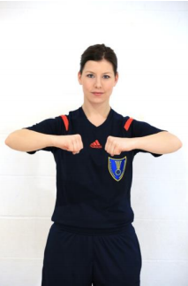
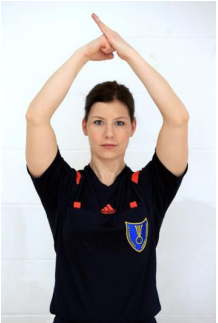
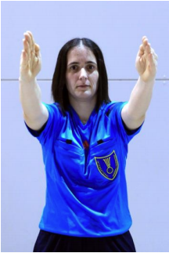
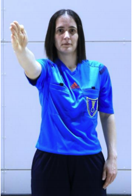
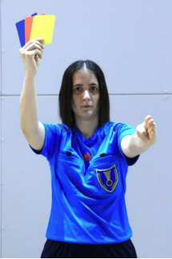
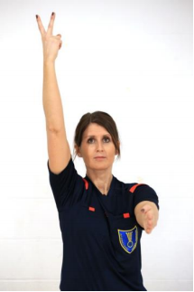
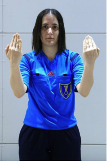

# Gestes

Lorsqu’un jet franc ou une remise en jeu est ordonné, les arbitres doivent
immédiatement indiquer la direction du jet (gestes 7 ou 9).

Par la suite, le(s) geste(s) obligatoire(s) approprié(s) devrai(en)t être effectué(s)
(gestes 13-14) pour indiquer toute sanction personnelle.

Lorsqu’il apparaît utile d’expliquer une décision de jet franc ou un jet de 7 mètres, il
convient d’effectuer l’un des gestes 1-6 et 11 pour information. Le geste 11 sera,
toutefois, toujours effectué dans les situations où la décision de jet franc pour cause de
jeu passif n’était pas précédée par le geste 17.

Les gestes 12, 15 et 16 sont obligatoires dans les situations où ils s’appliquent.

Les gestes 8, 10 et 17 sont utilisés si les arbitres les estiment nécessaires.

**Liste des gestes :**

1. [Empiètement sur la surface de but](#1---empiètement-sur-la-surface-de-but)
2. [Dribble irrégulier](#2---dribble-irrégulier)
3. [Marcher ou garder le ballon plus de 3 secondes](#3---marcher-ou-garder-le-ballon-plus-de-3-secondes)
4. [Ceinturer, retenir ou pousser](#4---ceinturer-retenir-ou-pousser)
5. [Frapper](#5---frapper)
6. [Faute d’attaquant](#6---faute-d’attaquant)
7. [Remise en jeu - direction](#7---remise-en-jeu---direction)
8. [Renvoi](#8---renvoi)
9. [Jet franc - direction](#9---jet-franc---direction)
10. [Non-respect de la distance des 3 m](#10---non-respect-de-la-distance-des-3-m)
11. [Jeu passif](#11---jeu-passif)
12. [But](#12---but)
13. [Avertissement (jaune) - Disqualification (rouge) - Rapport écrit - pour information (bleu)](#13---avertissement)
14. [Exclusion (2 minutes)](#14---exclusion)
15. [Arrêt du temps de jeu](#15---arrêt-du-temps-de-jeu)
16. [Autorisation accordée à deux personnes (autorisées à participer au jeu) de pénétrer sur l’aire de jeu pendant l’arrêt du temps de jeu](#16---autorisation-accordée-à-deux-personnes-de-pénétrer-sur-l’aire-de-jeu-pendant-l’arrêt-du-temps-de-jeu)
17. [Geste d’avertissement pour jeu passif](#17---geste-d’avertissement-pour-jeu-passif)

## 1 - Empiètement sur la surface de but

## 2 - Dribble irrégulier

## 3 - Marcher ou garder le ballon plus de 3 secondes

## 4 - Ceinturer, retenir ou pousser

## 5 - Frapper

## 6 - Faute d’attaquant

## 7 - Remise en jeu - direction

## 8 - Renvoi

## 9 - Jet franc - direction

## 10 - Non-respect de la distance des 3 m

## 11 - Jeu passif

## 12 - But

## 13 - Avertissement (jaune), Disqualification (rouge), Rapport écrit - pour information (bleu)

## 14 - Exclusion (2 minutes)

## 15 - Arrêt du temps de jeu

## 16 - Autorisation accordée à deux personnes (autorisées à participer au jeu) de pénétrer sur l’aire de jeu pendant l’arrêt du temps de jeu

## 17 - Geste d’avertissement pour jeu passif

