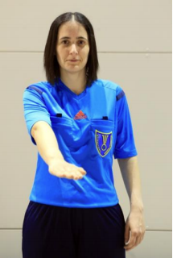
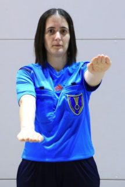
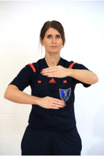
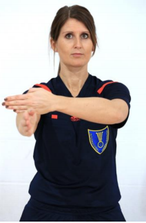
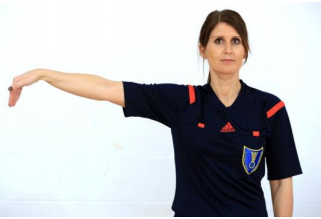
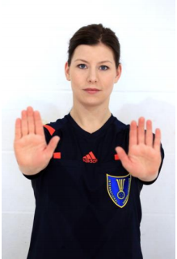
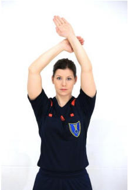
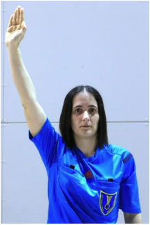
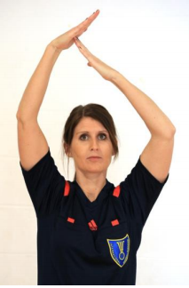
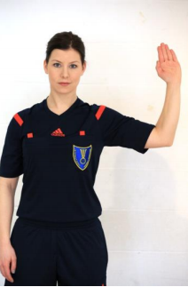

# Hand Signals

When a throw-in or free throw is called, the referees must show immediately the
direction for the throw that is to follow (signals 7 or 9).

Thereafter, as applicable, the appropriate obligatory hand signal(s) should be given, to
indicate any personal punishment (signals 13-14).

If it seems that it would also be useful to explain the reason for a free-throw or 7-metre
throw decision, then the applicable one of signals 1-6 and 11 could be given for the sake
of information. Signal 11 should, however, always be given in those situations where a
free-throw decision for passive play was not preceded by signal 17.

Signals 12, 15 and 16 are mandatory in those situations where they apply.

Signals 8, 10 and 17 are used as deemed necessary by the referees.

**List of the hand signals:**

1. [Entering the goal area](#1---entering-the-goal-area)
2. [Illegal dribble](#2---illegal-dribble)
3. [Too many steps or holding the ball for more than 3 seconds](#3---too-many-steps-or-holding-the-ball-for-more-than-3-seconds)
4. [Restraining, holding or pushing](#4---restraining,-holding-or-pushing)
5. [Hitting](#5---hitting)
6. [Offensive foul](#6---offensive-foul)
7. [Throw-in – direction](#7---throw-in-–-direction)
8. [Goalkeeper throw](#8---goalkeeper-throw)
9. [Free throw – direction](#9---free-throw-–-direction)
10. [Keep the distance of 3 metres](#10---keep-the-distance-of-3-meters)
11. [Passive play](#11---passive-play)
12. [Goal](#12---goal)
13. [Warning (yellow) – Disqualification (red)
    Information written report (blue)](#13---warning-(yellow),-disqualification-(red),-information-written-report-(blue))
14. [Suspension (2 minutes)](#14---suspension-(2-minutes))
15. [Time-out](#15---time-out)
16. [Permission for two persons (who are entitled to participate)
    to enter the court during time-out](#16---permission-for-two-persons-(who-are-entitled-to-participate)-to-enter-the-court-during-time-out)
17. [Forewarning signal for passive play](#17---forewarning-signal-for-passive-play)

## 1 - Entering the goal area

## 2 - Illegal dribble

## 3 - Too many steps or holding the ball for more than 3 seconds

## 4 - Restraining, holding or pushing

## 5 - Hitting

## 6 - Offensive foul

## 7 - Throw-in – direction

## 8 - Goalkeeper throw

## 9 - Free throw – direction

## 10 - Keep the distance of 3 meters

## 11 - Passive play

## 12 - Goal

## 13 - Warning (yellow), Disqualification (red), Information written report (blue)

## 14 - Suspension (2 minutes)

## 15 - Time-out

## 16 - Permission for two persons (who are entitled to participate) to enter the court during time-out

## 17 - Forewarning signal for passive play

