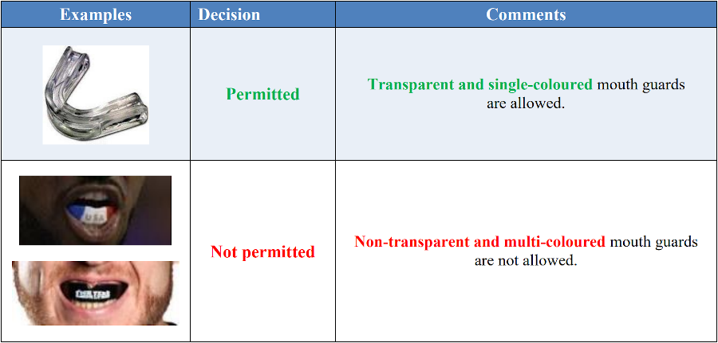
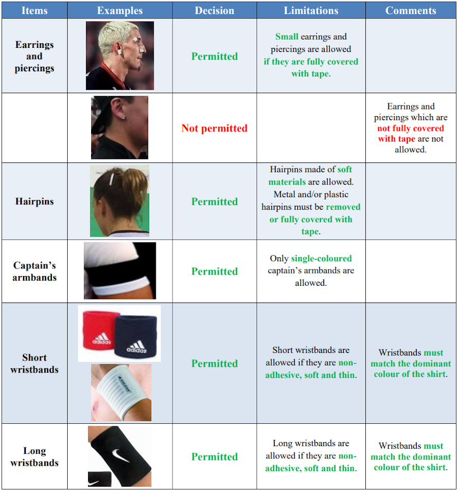

# Reglamento sobre equipos de protección y accesorios

Edición: Julio 2017

Origen: https://www.ihf.info/sites/default/files/2019-07/0_Regulations%20on%20Protective%20Equipment%20and%20Accessories_GB.pdf

## 1. Protección de cabeza / cara

## 2. Bandana para la cabeza

## 3. Lentes y gafas de protección

## 4. Protección bucal

## 5. Protección de hombro y mangas de compresión

## 6. Protección para codo (coderas)

## 7. Protección para rodilla (rodilleras)

## 8. Soportes de compresión para pantorrillas

## 9. Protección de la articulación del tobillo (tobilleras)

## 10. Ropa

***Resumen:***

- No se permite el uso de piernas largas (con la excepción del portero).

- Se permiten cuatro piezas (calzoncillos + protector de rodilla + soportes para pantorrilla de compresión + calcetines). Estas deben ser cuatro piezas separadas.

- La compresión y las mangas largas deben coincidir con el color dominante de la camisa.

- Los calzoncillos deben coincidir con el color dominante de los pantalones cortos.

- Los soportes de compresión para pantorrillas deben coincidir con el color de los calcetines.

- Los protectores de tobillo deben coincidir con el color de los calcetines.

- Los protectores de codo y rodilla pueden ser de cualquier color.

## 11. Accesorios

